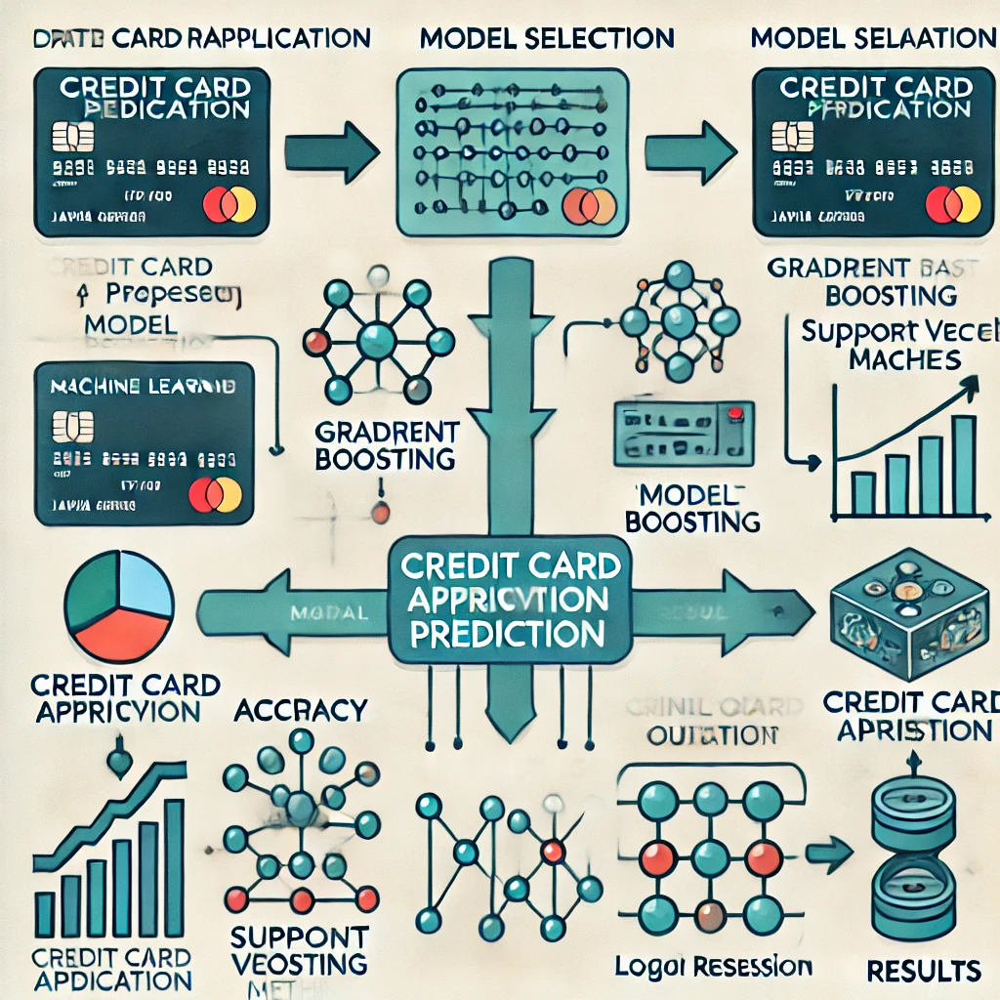

## Smart Credit Card Approval Prediction System using Machine Learning

**Background/Motivation:**

An essential procedure for financial companies, the study looks into the
automation of credit card application evaluations.The difficulty for
credit card providers is to quickly assess applications while lowering
risk. Conventional methods frequently depend on labor-intensive,
inconsistent rule-based systems or manual evaluations. While previous
research shows that machine learning (ML) can be used to make financial
decisions, there are still limitations in the application of
sophisticated ML approaches to credit card approvals. Numerous previous
research limit the generalizability and efficacy of their conclusions by
excluding ensemble approaches and comparative evaluations across
multiple algorithms. The goal of the study is to determine how
sophisticated machine learning approaches might improve credit card
approvals' efficiency, fairness, and correctness. Since it relates to
more general objectives of the financial sector, such increasing
operational effectiveness and reducing risks, answering this question is
essential. The study's emphasis on equity is especially pertinent in
light of the growing criticism of algorithmic bias in financial
judgment.

**Methodologies:**

Four machine learning models are used by the writers: 1)Random Forest
(RF): An ensemble learning technique that builds several decision trees
and produces the classification task's majority vote. 2)Gradient
Boosting (GB): A sequential ensemble method that efficiently lowers bias
and variance by optimizing for the residual errors of earlier models.
3)A supervised learning system called Support Vector Machines (SVM)
finds a hyperplane to classify data with the largest margin possible.
4)Logistic Regression (LR): A statistical model frequently employed for
binary classification, LR uses a sigmoid function to estimate
probabilities.

**Mathematical and Statistical Background:**

1)Random Forest (RF): Each decision tree is built from a bootstrap
sample, using a subset of features to determine splits. Final
prediction, y\^, is the mode of predictions from n trees:
y\^=mode(T1(x),T2(x),…,Tn(x))

2)Gradient Boosting (GB): Sequentially minimizes a loss function
L(y,f(x)) using gradient descent. At each step m, the model updates as:

f m+1(x)=f m(x)−η∇L(y,f m(x))

where η is the learning rate.

3)Support Vector Machines (SVM): The algorithm finds a hyperplane
w⋅x+b=0 that maximizes the margin, defined as:

Margin= 2 / ∥w∥ ​

Subject to constraints: y i(w⋅x i+b)≥1

4)Logistic Regression (LR): Models the probability P(y=1∣x) using the
sigmoid function: P(y=1∣x)= 1/1+e −βTx ​.

By striking a balance between interpretability (LR), non-linearity
handling (SVM), and prediction power (RF and GB), the chosen approaches
together answer the study issue. Ensemble techniques like RF and GB are
especially well-suited to deal with imbalanced datasets and reduce
overfitting, which are frequent in credit card acceptance situations.
One noteworthy innovation in this work is the incorporation of fairness
metrics into model evaluation. It guarantees that the suggested models
avoid adding bias against particular demographic groups in addition to
performing well in terms of accuracy.

{width="371"}

**Significance of the Work:**

The study's findings show that Gradient Boosting fared better than other
approaches in terms of fairness and accuracy, with a 92.5% accuracy rate
with little bias. SVM and Logistic Regression were less successful for
this application, whereas Random Forest came in second. Relevance to the
Field: The study emphasizes how crucial ensemble approaches are for
financial applications. Additionally, it emphasizes the necessity of
incorporating fairness issues, an area that has received little
attention in previous research. Financial firms looking to implement
ML-based systems can benefit from the research' practical advice.
Additionally, they open the door for more research into fairness-aware
machine learning models, such as adversarial debiasing and fairness
restrictions.

**Relation to Other Work:**

Breiman's work on Random Forests and Friedman's developments in Gradient
Boosting are two examples of the foundational research in machine
learning for financial decision-making that the paper relies upon. In
contrast to previous studies, our work addresses both performance and
ethical issues by integrating sophisticated machine learning algorithms
with fairness measurements.

**Relevance to Capstone Project:**

This study has a lot to do with a capstone project that focuses on
machine learning applications in financial settings. Creating reliable
and moral prediction systems can be modeled after the approaches and
fairness-focused evaluation framework. Certain components, including the
application of fairness measures and ensemble procedures, can be
implemented directly. Furthermore, the thorough evaluation procedure
offers a helpful benchmarking reference. Possible Extensions: The
capstone project might investigate: i)Sophisticated ensemble methods
like LightGBM and XGBoost. ii)Including interpretability tools such as
LIME or SHAP. iii) A comparison of metrics for fairness among various
demographic groups.

**References**

Kim, J., & Lee, M. (2024). Smart Credit Card Approval Prediction System
using Machine Learning. E3S Web of Conferences. Retrieved from
<https://www.e3s-conferences.org/articles/e3sconf/abs/2024/70/e3sconf_icpes2024_13001/e3sconf_icpes2024_13001.html>
